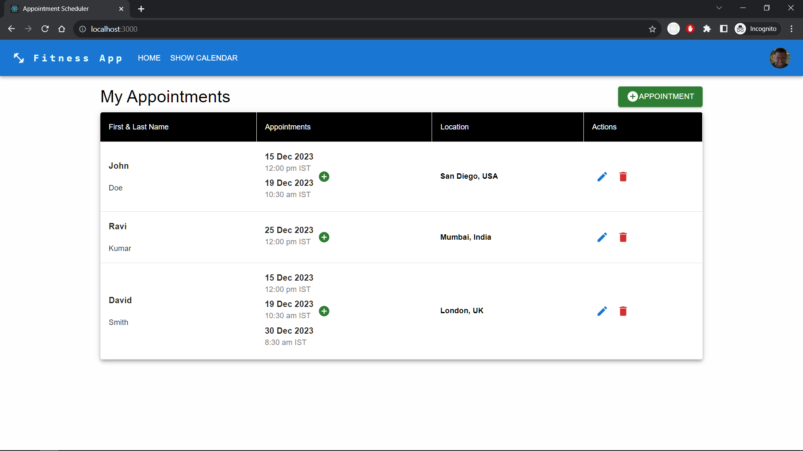
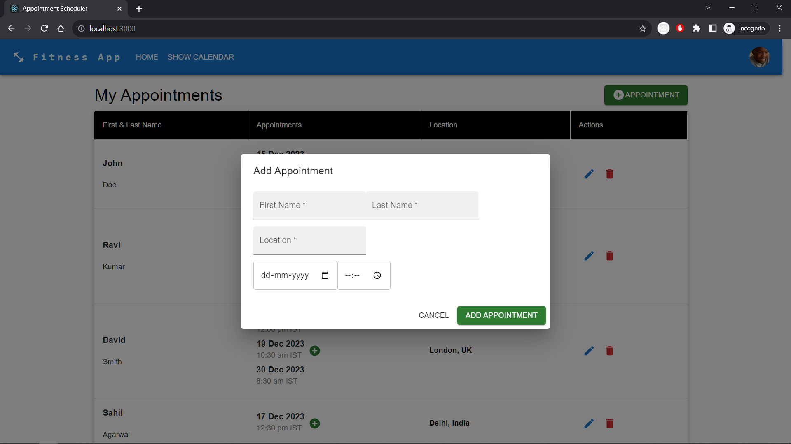
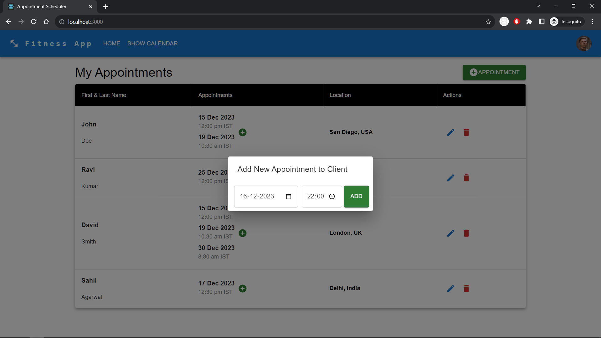
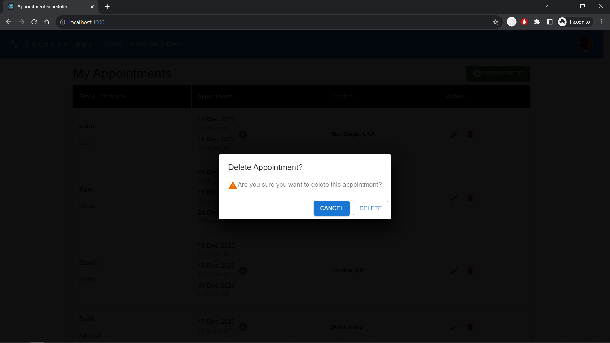

# Fitness Trainer Appointments Scheduler

This React Web Application can be used to manage appointments for a fitness trainer to perform operations like add, edit, and delete appointments for clients.

## Table of Contents

- [Technologies Used](#technologies-used)
- [Installation](#installation)
- [Usage](#usage)
- [Screenshots](#screenshots)
- [Author](#author)

### Technologies Used

- React.js - JavaScript Library for UI
- JavaScript - Programming Language
- MUI - Component-based UI Library
- MUI Icons - Icons Library

### Installation

1. clone the repository from the GitHub to a newly created folder

```
git clone https://github.com/mazam5/Fitness-Trainer-Appointment-Scheduler
```

2. Navigate to the folder where you have cloned the repository

Open the folder in VS Code or any other editor

3. Install the Necessary JavaScript Packages by running the below command in cmd or terminal

```
npm install
```

or

```
yarn install
```

4 Run the below command to start the application

```
npm start
```

or

```
yarn start
```

Your Project will be running on http://localhost:3000

If above commands are not working, try installing the Node.js from the below link

https://nodejs.org/en/download/

or

Yarn from the below link

https://classic.yarnpkg.com/en/docs/install/

### Usage

- Add Appointment

  - Click on the Add Appointment Button
  - Enter the Client's First & Last Name, Appointment Date & Time, and Location
  - Click on the Add Appointment Button

- Edit Appointment

  - Click on the Edit (Pencil) Icon on the Appointment Row
  - Edit the Client's First & Last Name, Location, Date, and Time
  - Click on the Save Button

- Delete Appointment
  - Click on the Delete (bin) Icon on the Appointment Row
  - A Dialog Box will appear to confirm the deletion
  - Click on the Delete Button

### Screenshots





